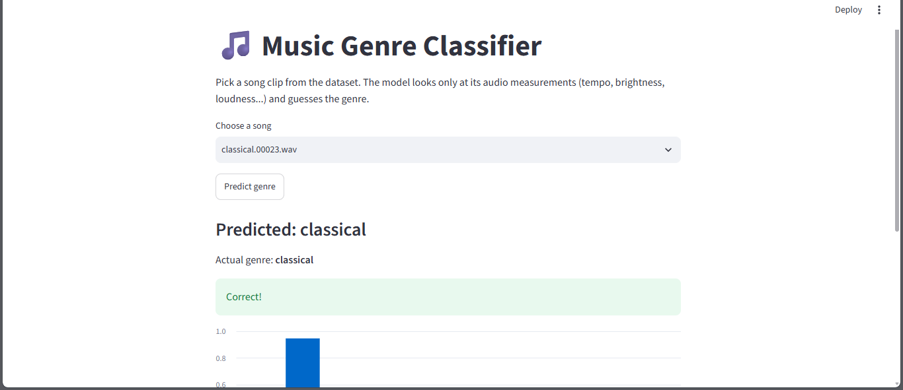

# 🎵 Music Genre Classifier

A machine learning app that predicts a song's genre from its audio features.

## About
The model is trained on the GTZAN dataset (1,000 30-second clips across 10 genres).
It uses audio measurements like tempo, brightness, and loudness rather than the
raw audio, and a Random Forest classifier learns which patterns match each genre.

## Results
- Model: Random Forest (200 trees)
- Test accuracy: XX% (random guessing would be 10%)
- Easiest genres: ...
- Most confused genres: ... (and why that makes sense)

## Project structure
- `notebooks/01_explore.ipynb`: data exploration
- `notebooks/02_modeling.ipynb`: training and evaluation
- `app.py`: Streamlit demo
- `models/`: saved model
- `data/`: dataset

## How to run
1. Clone the repo
2. `pip install -r requirements.txt`
3. Download `features_30_sec.csv` from the GTZAN dataset on Kaggle into `data/`
4. `streamlit run app.py`

## Limitations
The demo picks songs from the dataset, and the model was trained on most of them,
so predictions on those songs look better than they would on brand-new music.

## Future improvements
- Upload your own audio file using `librosa`
- Try other models (SVM, XGBoost) and tune them
